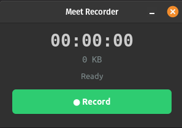

# meetscribe

Fully local meeting transcription with speaker diarization, AI-generated
summaries, and professional PDF output.

Records dual-channel audio (your mic + system audio) from **any** meeting
app and produces diarized transcripts using WhisperX + pyannote-audio.
Everything runs on your machine -- no cloud APIs, no data leaves your computer.

## Works with any meeting app

Because meetscribe captures system audio at the OS level, it works with
every voice/video call application:

- **Zoom**
- **Google Meet**
- **Microsoft Teams**
- **Slack** (huddles and calls)
- **Discord**
- **Signal** (voice and video calls)
- **Telegram** (voice and video calls)
- **WhatsApp** (desktop voice and video calls)
- **Keet** (P2P calls)
- **Jitsi Meet**
- **Webex**
- **Skype**
- **FaceTime** (via browser)
- **GoTo Meeting**
- **RingCentral**
- **Amazon Chime**
- **BlueJeans**

Any app that plays audio through your system speakers will work --
including browser-based meetings and standalone desktop clients.

## Features

- **Dual-channel audio capture** -- records your mic (left channel) and remote
  participants (right channel) simultaneously via PipeWire/PulseAudio + ffmpeg
- **WhisperX transcription** -- fast batched inference with
  `openai/whisper-large-v3-turbo`, word-level timestamps via wav2vec2 alignment
- **Speaker diarization** -- pyannote-audio identifies who said what, with
  automatic YOU/REMOTE labeling from the dual-channel signal
- **AI meeting summaries** -- local LLMs via Ollama extract key topics, action
  items, decisions, and follow-ups
- **Professional PDF output** -- summary + full transcript in a clean,
  page-numbered PDF
- **Multiple output formats** -- `.txt`, `.srt`, `.json`, `.summary.md`, `.pdf`
- **GTK3 GUI widget** -- small always-on-top window with record/stop, timer,
  and one-click access to results
- **CLI** -- `meet record`, `meet transcribe`, `meet run`, `meet gui`,
  `meet devices`, `meet check`
- **Per-session folders** -- each recording gets its own organized directory
- **Offline** -- after initial model download, everything works without internet

## Quick start

```bash
# Install
pip install -e /path/to/meetscribe

# Set your HuggingFace token (required for speaker diarization)
export HF_TOKEN=hf_your_token_here

# Record a meeting, then auto-transcribe + summarize when you stop
meet run
# Press Ctrl+C when the meeting ends
```

## Requirements

- **Linux** with PipeWire or PulseAudio
- **NVIDIA GPU** with CUDA (8GB+ VRAM recommended; CPU mode available but slower)
- **Python 3.10+**
- **ffmpeg**
- **HuggingFace token** (free) for the diarization model
- **Ollama** (optional) for AI meeting summaries

See [REQUIREMENTS.md](REQUIREMENTS.md) for full hardware/software details.

## Installation

### 1. System dependencies

```bash
# Ubuntu / Pop!_OS / Debian
sudo apt install ffmpeg pulseaudio-utils

# Fedora
sudo dnf install ffmpeg pulseaudio-utils
```

### 2. Install meetscribe

```bash
pip install -e /path/to/meetscribe
```

This creates the `meet` command in your PATH.

### 3. HuggingFace token (for speaker diarization)

1. Create a free account at https://huggingface.co
2. Accept the model terms at https://huggingface.co/pyannote/speaker-diarization-community-1
3. Create a read token at https://huggingface.co/settings/tokens
4. Set it:

```bash
export HF_TOKEN=hf_your_token_here
# Add to ~/.bashrc for persistence:
echo 'export HF_TOKEN=hf_your_token_here' >> ~/.bashrc
```

### 4. Ollama (optional, for AI summaries)

Install from https://ollama.com, then pull the default summary model:

```bash
ollama pull qwen3.5:9b
```

### 5. Verify setup

```bash
meet check
```

## Usage

### Check audio devices

```bash
meet devices
```

### Record a meeting

Start recording before or during your meeting:

```bash
meet record
```

Press Ctrl+C when the meeting ends. A 10-second drain buffer ensures all audio
is captured. Recordings are saved to `~/meet-recordings/`.

Options:
- `-o /path` -- save recordings elsewhere
- `--virtual-sink` -- create isolated virtual sink (avoids capturing notification sounds)
- `--mic <source>` -- specify mic source (use `meet devices` to find names)
- `--monitor <source>` -- specify monitor source

### Transcribe a recording

```bash
meet transcribe ~/meet-recordings/meeting-20260312-140000/meeting-20260312-140000.wav
```

Options:
- `-m large-v3-turbo` -- Whisper model (default: `large-v3-turbo`; also: `base`, `medium`, `large-v2`)
- `--device cuda` -- `cuda` or `cpu` (default: `cuda`)
- `--compute-type float16` -- `float16` or `int8` for lower VRAM (default: `float16`)
- `-b 16` -- batch size, reduce if running low on VRAM (default: `16`)
- `--min-speakers 2` / `--max-speakers 6` -- hint for number of speakers
- `--no-diarize` -- skip speaker diarization
- `--no-summarize` -- skip AI summary generation
- `--summary-model <model>` -- Ollama model for summary (default: `qwen3.5:9b`)

### Record + transcribe in one shot

```bash
meet run
```

Records until Ctrl+C, then automatically transcribes, generates a summary,
and produces a PDF. Takes all options from both `record` and `transcribe`.

### Launch the GUI widget

```bash
meet gui
```

A small always-on-top window with:
- Record / Stop button
- Live timer and file size
- Status indicator (Recording, Flushing, Transcribing, Summarizing, Done)
- "Open PDF" and "Open Folder" buttons after completion



## Output

Each recording gets its own session directory:

```
~/meet-recordings/meeting-20260312-140000/
    meeting-20260312-140000.wav            # Stereo audio (16kHz)
    meeting-20260312-140000.session.json   # Recording metadata
    meeting-20260312-140000.ffmpeg.log     # ffmpeg capture log
    meeting-20260312-140000.txt            # Plain text transcript
    meeting-20260312-140000.srt            # Subtitle format
    meeting-20260312-140000.json           # Full detail (word-level timestamps)
    meeting-20260312-140000.summary.md     # AI meeting summary (Markdown)
    meeting-20260312-140000.pdf            # Professional PDF (summary + transcript)
```

Example `.txt` output:

```
[00:00:12 --> 00:00:18] YOU: So the main issue we're seeing is with the API rate limiting.
[00:00:19 --> 00:00:25] REMOTE_1: Right, I think we should implement exponential backoff.
[00:00:26 --> 00:00:31] YOU: Agreed. Can you also look at caching the responses?
```

## AI summary

When Ollama is running, meetscribe generates a structured meeting summary with:
- Overview
- Key topics discussed
- Action items (with owners when mentioned)
- Decisions made
- Open questions / follow-ups

### Supported models

| Model | Size | Speed | Notes |
|-------|------|-------|-------|
| `qwen3.5:9b` | 6.6 GB | ~18-35s | **Default** -- best balance of quality and speed |
| `gemma3:12b` | 8.1 GB | ~15s | Fastest |
| `qwen3:14b` | 9.3 GB | ~39s | Good quality |
| `glm-4.7-flash` | 19 GB | ~37s | Must use thinking-off mode (handled automatically) |

Change the model:

```bash
meet run --summary-model gemma3:12b
```

Disable summaries:

```bash
meet run --no-summarize
```

## Virtual sink mode

By default, `meet record` captures all system audio (including notification
sounds, music, etc.). For cleaner recordings, use `--virtual-sink`:

```bash
meet record --virtual-sink
```

This creates an isolated audio sink. Route your meeting app's audio to it:

1. Open `pavucontrol` (PulseAudio Volume Control)
2. Go to the "Playback" tab
3. Find your browser or meeting app
4. Change its output to "Meet-Capture"

You'll still hear the meeting through your normal speakers via automatic loopback.

## VRAM usage

With an NVIDIA GPU (12 GB VRAM):

| Model | Transcription | + Diarization | Recommended batch_size |
|-------|--------------|---------------|----------------------|
| large-v3-turbo | ~4 GB | ~7 GB total | 16 |
| medium | ~3 GB | ~6 GB total | 16 |
| base | ~1 GB | ~4 GB total | 16 |

If you hit OOM errors:
1. Reduce `--batch-size` to 4 or 8
2. Use `--compute-type int8`
3. Use a smaller model (`--model medium` or `--model base`)
4. Use `--device cpu` as a last resort

## How it works

```
[Meeting App] --> [PipeWire/PulseAudio] --> [ffmpeg dual-channel capture] --> meeting.wav
                                                                                  |
                  [WhisperX: faster-whisper + wav2vec2 alignment + pyannote diarization]
                                                                                  |
                                      [Ollama LLM summary]     [Diarized transcript]
                                              |                         |
                                        .summary.md          .txt / .srt / .json
                                              |                         |
                                              +--------> .pdf <---------+
```

**Capture**: Records your mic (left channel) and system audio (right channel)
simultaneously into a single stereo WAV file at 16 kHz.

**Transcribe**: Runs the WhisperX pipeline -- batched Whisper transcription,
wav2vec2 forced alignment for word-level timestamps, and pyannote speaker
diarization. Dual-channel energy analysis maps speakers to YOU or REMOTE.

**Summarize**: Sends the transcript to a local Ollama model that extracts
a structured summary.

**PDF**: Combines the summary and full transcript into a professional
page-numbered PDF document.

## CUDA NVRTC note

The pyannote diarization model requires CUDA NVRTC for JIT compilation. If your
CUDA driver version doesn't match the installed libnvrtc-builtins version,
meetscribe automatically creates a compatibility symlink. This happens
transparently on first use.

If you still see NVRTC errors:

```bash
export LD_LIBRARY_PATH=$HOME/.local/lib/cuda:$LD_LIBRARY_PATH
```

## Limitations

- Overlapping speech is not handled well (Whisper limitation)
- Speaker labels are role-based (YOU, REMOTE_1, REMOTE_2) not actual names
- Diarization accuracy varies with audio quality and number of speakers
- English only (for now)
- Linux only (PulseAudio/PipeWire dependency)

## License

[GPL-3.0](LICENSE)
